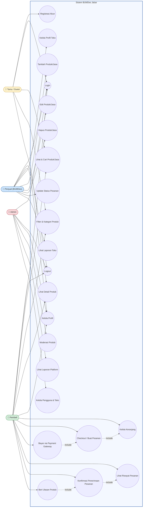
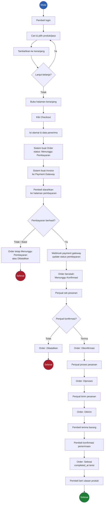
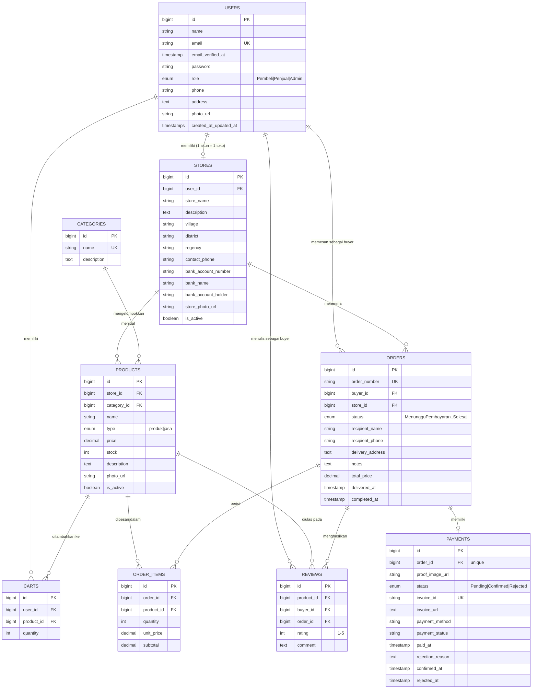
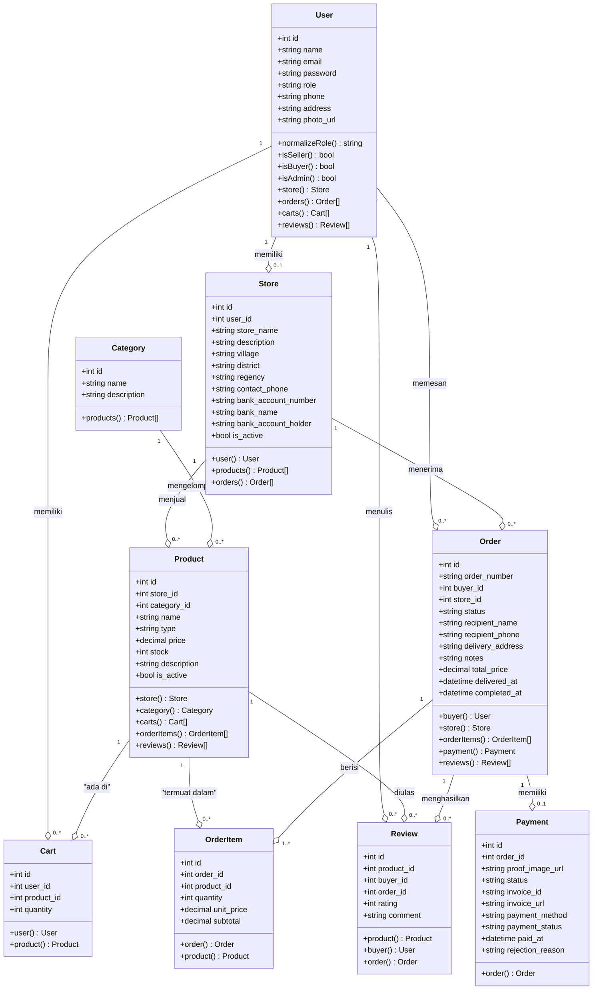
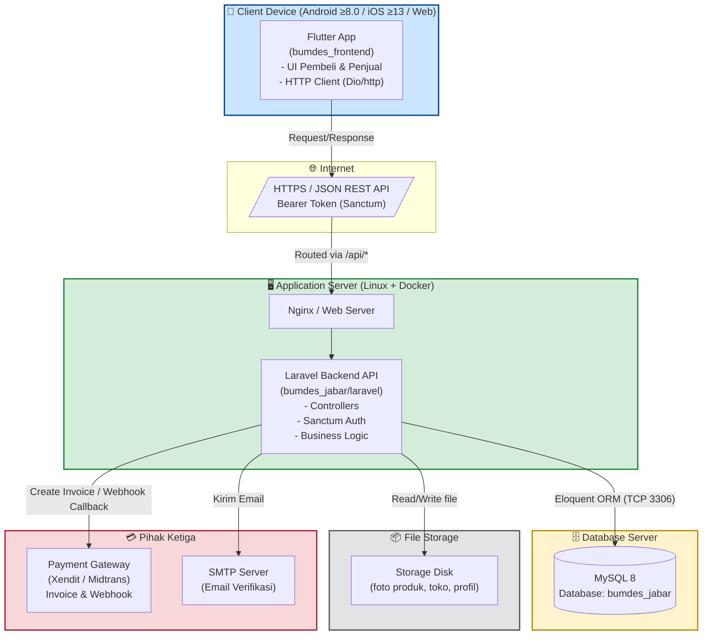
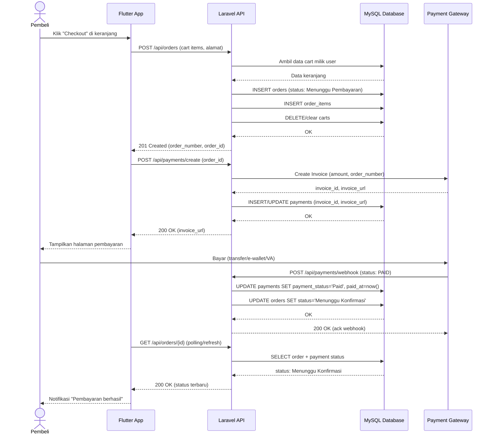

# Dokumen Perancangan Sistem — BUMDes Jabar
Marketplace Produk & Jasa Antar BUMDes di Jawa Barat

Disusun berdasarkan **SRS BUMDes Jabar v2.0** dan implementasi kode program (**Laravel** backend + **Flutter** frontend, **MySQL** database).

Berisi: Use Case Diagram, Activity Diagram, Rancangan Database (ERD), Class Diagram, Deployment Diagram, dan Sequence Diagram — seluruhnya dalam notasi **Mermaid** agar garis/relasi rapi dan dapat dirender otomatis oleh GitHub, Obsidian, VS Code (ekstensi Mermaid), Typora, dsb.

---

## Daftar Isi
1. [Use Case Diagram](#1-use-case-diagram)
2. [Activity Diagram](#2-activity-diagram)
3. [Rancangan Database (ERD)](#3-rancangan-database-erd)
4. [Class Diagram](#4-class-diagram)
5. [Deployment Diagram](#5-deployment-diagram)
6. [Sequence Diagram](#6-sequence-diagram)

---

## 1. Use Case Diagram

Aktor: **Tamu (Guest)**, **Pembeli**, **Penjual**, **Admin** — sesuai bab 2.3 SRS dan hak akses pada `routes/api.php`.

> **Catatan relasi:** `Checkout/Buat Pesanan` *include* `Kelola Keranjang`; `Bayar via Payment Gateway` *include* `Checkout`; `Konfirmasi Penerimaan` *include* `Lihat Riwayat Pesanan`; `Beri Ulasan` hanya dapat dilakukan setelah `Konfirmasi Penerimaan` (status `Selesai`).

---

## 2. Activity Diagram

Alur utama: **Pembeli melakukan pemesanan hingga pembayaran**, sesuai `OrderController` & `PaymentController`.

---

## 3. Rancangan Database (ERD)

Disusun dari migration: `users`, `stores`, `categories`, `products`, `carts`, `orders`, `order_items`, `payments`, `reviews`.

**Catatan kunci/constraint penting:**
- `stores.user_id` → unique relation (1 user = 1 toko, sesuai aturan bisnis 5.5 SRS).
- `carts` unik pada `(user_id, product_id)` agar satu produk tidak dobel di keranjang yang sama.
- `payments.order_id` unik (1 order = 1 payment) + `invoice_id` unik dari payment gateway.
- `reviews` unik pada `(product_id, buyer_id, order_id)` — satu ulasan per produk per transaksi.
- `orders.status` mengikuti alur: `Menunggu Pembayaran → Menunggu Konfirmasi → Dikonfirmasi → Diproses → Dikirim → Selesai` (atau `Dibatalkan`).

---

## 4. Class Diagram

Mengikuti struktur model Eloquent pada `app/Models/*.php`.

---

## 5. Deployment Diagram

Berdasarkan arsitektur SRS (2.1, 3.4) dan struktur proyek: **Flutter mobile/web app**, **Laravel REST API**, **MySQL**, **Payment Gateway (Xendit/Midtrans)** pihak ketiga.

---

## 6. Sequence Diagram

Skenario: **Pembeli melakukan checkout dan pembayaran** (`POST /api/orders` → `POST /api/payments/create` → webhook).

---

## Ringkasan Pemetaan Diagram ↔ Sumber

| Diagram | Sumber Utama |
|---|---|
| Use Case | SRS Bab 2.3 (Kelas Pengguna) & Bab 4 (Fitur Sistem) |
| Activity | `OrderController`, `PaymentController` — alur status order |
| ERD | `database/migrations/*.php` |
| Class Diagram | `app/Models/*.php` (relasi Eloquent) |
| Deployment | SRS Bab 2.1, 2.4, 3.4 + struktur folder `bumdes_frontend` & `bumdes_jabar/laravel` |
| Sequence | `routes/api.php` endpoint `/orders`, `/payments/create`, `/payments/webhook` |

---

*Dokumen ini dibuat otomatis berdasarkan analisis SRS BUMDes Jabar v2.0 dan source code proyek (`Project-UTS-UAS.zip`). Semua diagram menggunakan sintaks Mermaid sehingga garis dan tata letak konsisten saat dirender di GitHub, VS Code, Obsidian, atau Typora.*
